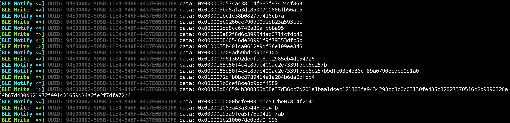

# blemon
Universal BLE Monitoring with Frida (or Objection)

The standalone script can be used directly with [Frida](https://www.frida.re) in order to monitor basic BLE traffic between a mobile device (central) and a BLE peripheral. Characteristic reads, writes and notifications are supported for both Android and iOS.

## Screenshots

BLE Monitor script being run on Android as an Objection Plugin while monitoring a BLE enabled garage door opener app.

BLE Monitor script being run directly in Frida on iOS while monitoring a BLE enabled padlock app.
## Features
- Automatically detects target operating system (iOS or Android) and runs appropriate hooks
- Designed to be universal so that BLE events can be monitored regardless of the application code
- Monitors characteristic reads, writes and notifications
- Colorized output and chararcteristic UUID tagging for easier event monitoring
- Data is always displayed in hexadecimal format to support binary payloads

## How it Works
Once loaded, the script will automatically detect which operating system it is running in and perform the relevant hooks. For Android, this is done by hooking any overriden instance methods of the [android.bluetooth.BluetoothGattCallback](https://developer.android.com/reference/android/bluetooth/BluetoothGattCallback.html) class. On iOS, the script will attach to the [writeValue method](https://developer.apple.com/documentation/corebluetooth/cbperipheral/1518747-writevalue?language=objc) of any instances of the CBPeripheral class as well as the [value property](https://developer.apple.com/documentation/corebluetooth/cbcharacteristic/1518878-value?language=objc) of any CBCharacteristic class instances. These two hooking strategies should allow the script to work regardless of any custom code or BLE wrappers being used.

## Objection plugin
This repository also contains an [Objection](https://github.com/sensepost/objection) plugin folder which uses a slightly modifed version of the same script. Ensure you have the `__init__.py` and `script.js` files inside a plugin folder of your choice. After using either the REPL plugin command or specifying the plugin folder from the command line, the plugin can then be activated using:

`plugin ble monitor`
